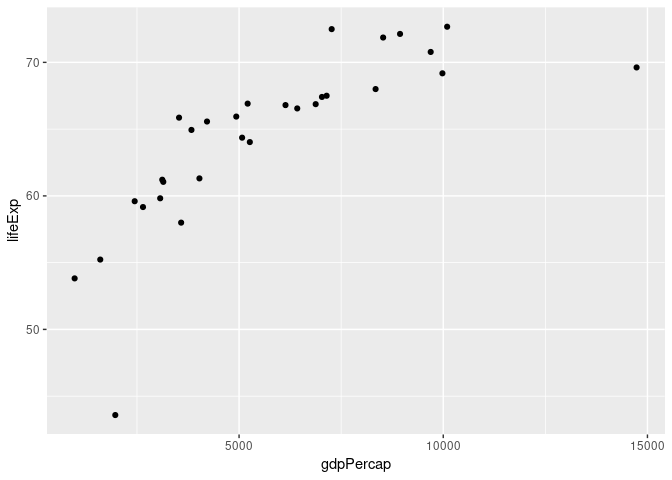

Gapminder Exercise Template
================
Min Chul Kim
2018-08-20

## Load packages

``` r
library(tidyverse)
```

## Load data

``` r
gap <- read_csv("https://bit.ly/gap_data_upd")
```

    ## Parsed with column specification:
    ## cols(
    ##   country = col_character(),
    ##   continent = col_character(),
    ##   year = col_integer(),
    ##   lifeExp = col_double(),
    ##   pop = col_double(),
    ##   gdpPercap = col_double()
    ## )

## Exercises

### Exercise 1

How many observations are in this dataset?

There are 1704 observations in the dataset.

### Exercise 2

Visualize the relationship between GDP and life expectancy for countries
in Europe in 1952 using a scatter plot.

<!-- -->

### Exercise 3

Add year 1967 in another color.
